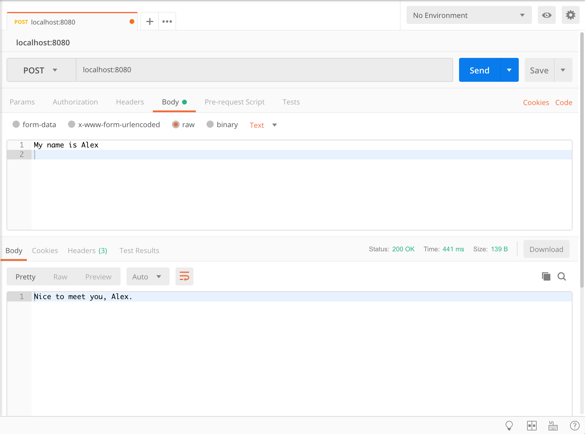

# Rivescript Chatbot

## Prerequisite

* GIT and Docker must be installed !

## Clone & Run  

     $ git clone git@github.com:erebos12/chatbot.git
     $ cd chatbot
     $ docker build -t chatbot .   // build docker image
     $ docker run -p 8080:8080 chatbot   // start docker container
     OR under Linux/Mac 
     $ ./build_and_run.sh

## Test/Use it  
     
* Open a REST client (i.e. Postman) and send a POST request to localhost:8080 with the message 
you want to send to the chatbot. See screenshot as a sample:

